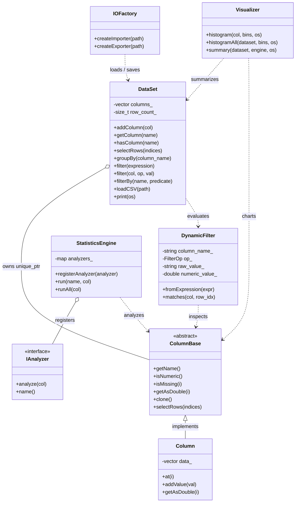

# PPC Data Analytics Library (C++17)

[](https://en.cppreference.com/w/cpp/17)
[](Makefile)
[](Makefile)
[](LICENSE)

A lightweight, high-performance, and modular **C++17 data analytics library** built with clean Object-Oriented Programming (OOP) and modern design patterns.

---

## Highlights

- **Heterogeneous Tabular Storage**: Unified `DataSet` containing strongly typed columns (`int`, `double`, `std::string`).
- **RFC-4180 CSV Parser & Auto Type Inference**: Automatic detection of integer, floating-point, and string columns with quoted-field and UTF-8 BOM support.
- **Strategy Pattern Statistics Engine**: Modular statistical metrics (`mean`, `median`, `stddev`, `stddev_sample`, `min`, `max`, `mode`, `sum`) + custom analyzer support.
- **Dynamic Runtime & Expression Filtering**: Filter datasets by natural expression queries (e.g. `"Age > 18"`, `"Score >= 90"`, `"Grade == A"`), structured operators (`>`, `<`, `>=`, `<=`, `==`, `!=`), or typed C++ lambdas (`filterBy<T>`).
- **Pandas/SQL-Style GroupBy & Aggregations**: Partition datasets by single or multiple columns with `groupBy()`, compute grouped metrics (`mean`, `count`, `sum`, `min`, `max`, `stddev`), or iterate over group sub-datasets directly.
- **Factory Pattern File I/O**: Extension-based loader/exporter for CSV and structured JSON.
- **Terminal Visualizer**: In-terminal ASCII histograms and pandas-style `describe()` statistical summaries (Count, Mean, Median, Mode, Std, Min, 25%, 50%, 75%, Max).
- **Strict RAII & Memory Safety**: Managed via `std::unique_ptr` and deep copy cloning (`clone()`).

---

## Quick Start

### Build and Run

```bash
# Build demo (bin/demo.exe) and test suites (bin/analytics_tests.exe, bin/test_groupby.exe)
make -j4

# Run demo with interactive filter prompt:
make run

# Or pass a filter query directly via CLI:
./bin/demo.exe "Score >= 90"
./bin/demo.exe "Grade == A"
./bin/demo.exe data/sample.csv "Age < 25"

# Run full test suite (43 test cases, 278 assertions)
make test

# Clean build artifacts
make clean
```

### Demo Output (`main.cpp`)

```text
Loading dataset from: data/sample.csv
Name, Age, Score, Grade, H_score
Alice, 21, 92.5, A, 5
Bob, 17, 78, C, 12
Mitansu, 25, 88.5, B, 13
Zaheer, 100, 65, A, 15
Emma, 22, 95, D, 45
Soumya, 19, 100, B, 100
Sanchit, 100, 100, A, 100

Mean age: 43.4286
Median age: 22

--- Dynamic Filter ---
Available columns: [ Name Age Score Grade H_score ]
Applying filter from argument: [Age > 18]
Filtered from 7 rows down to 6 rows.

Filtered data is as follows: 
Name, Age, Score, Grade, H_score
Alice, 21, 92.5, A, 5
Mitansu, 25, 88.5, B, 13
Zaheer, 100, 65, A, 15
Emma, 22, 95, D, 45
Soumya, 19, 100, B, 100
Sanchit, 100, 100, A, 100

--- Visualizations (Histograms) ---
Age distribution

17.00 - 37.75      | ***** (5)
37.75 - 58.50      |  (0)
58.50 - 79.25      |  (0)
79.25 - 100.00     | ** (2)

Score distribution

65.00 - 73.75      | * (1)
73.75 - 82.50      | * (1)
82.50 - 91.25      | * (1)
91.25 - 100.00     | **** (4)

H_score distribution

5.00 - 28.75       | **** (4)
28.75 - 52.50      | * (1)
52.50 - 76.25      |  (0)
76.25 - 100.00     | ** (2)

--- Statistical Summary (describe) ---
Statistic              Age           Score         H_score
----------------------------------------------------------
Count                    7               7               7
Mean               43.4286         88.4286         41.4286
Median             22.0000         92.5000         15.0000
Mode              100.0000        100.0000        100.0000
Std                38.7249         12.8141         41.9796
Min                17.0000         65.0000          5.0000
25%                20.0000         83.2500         12.5000
50%                22.0000         92.5000         15.0000
75%                62.5000         97.5000         72.5000
Max               100.0000        100.0000        100.0000

--- Group By Demonstration (Grade) ---
Found 4 distinct grades:
  - Grade [A]: 3 student(s), Mean Score = 85.8333, Sum Score = 257.5
  - Grade [B]: 2 student(s), Mean Score = 94.25, Sum Score = 188.5
  - Grade [C]: 1 student(s), Mean Score = 78, Sum Score = 78
  - Grade [D]: 1 student(s), Mean Score = 95, Sum Score = 95
```

---

## Architecture Overview



---

## Core Usage

### 1. Load CSV & Automatic Type Detection
```cpp
#include "analytics/DataSet.h"

DataSet ds;
ds.loadCSV("data/sample.csv"); // Autodetects int, double, and string
ds.print(std::cout);
```

### 2. Run Statistics (Strategy Pattern)
```cpp
#include "analytics/StatisticsEngine.h"

StatisticsEngine engine;
const auto& age = ds.getColumn("Age");

double mean_age   = engine.run("mean", age);
double median_age = engine.run("median", age);
double sample_std = engine.run("stddev_sample", age);
double sum_age    = engine.run("sum", age);

// Or run all metrics at once:
auto all_metrics = engine.runAll(age);
```

### 3. Dynamic & Typed Filtering

The library supports both **runtime query expressions** (type-agnostic, works on any dataset) and **compile-time predicate lambdas**:

#### A. Natural Query Expressions
```cpp
// Filter by natural string query across any column type:
DataSet adults   = ds.filter("Age > 18");
DataSet topScore = ds.filter("Score >= 90.0");
DataSet gradeA   = ds.filter("Grade == A");         // or with quotes: "Grade == 'A'"
DataSet notBob   = ds.filter("Name != Bob");

// Chained multi-column filtering (logical AND):
DataSet honorAdults = ds.filter("Age > 18")
                        .filter("Score >= 90.0");
```

#### B. Structured Dynamic Filters
```cpp
// Specify column name, operator, and threshold separately:
DataSet adults = ds.filter("Age", ">", 18);
DataSet gradeA = ds.filter("Grade", "==", "A");
DataSet score  = ds.filter("Score", ">=", 85.5);
```

#### C. Typed Lambda Filtering (Compile-Time)
```cpp
// Returns a new DataSet; original remains untouched
DataSet adults = ds.filterBy<int>("Age", [](const int& age) {
    return age >= 18;
});
```

#### D. Interactive & Command-Line Filter Execution
The demo application (`main.cpp`) accepts command-line queries or prompts interactively:
```bash
# Pass filter directly as a CLI argument:
./bin/demo.exe "Score >= 90"
./bin/demo.exe "Grade == A"
./bin/demo.exe data/sample.csv "Age < 25"

# Or run interactively (prompts for column and condition with typo recovery):
make run
```

### 4. Export Data (Factory Pattern)
```cpp
#include "analytics/IOFactory.h"

// Automatically selects JsonExporter based on file extension
auto exporter = IOFactory::createExporter("output.json");
exporter->save(adults, "output.json");
```

### 5. Group By (Partition Tabular Data)
```cpp
// Partition dataset into subsets by distinct column values:
std::map<std::string, DataSet> groups = ds.groupBy("Grade");

// Iterate through each group and compute metrics with StatisticsEngine:
for (const auto& [grade, group_ds] : groups) {
    double mean_score = engine.run("mean", group_ds.getColumn("Score"));
    double sum_score  = engine.run("sum", group_ds.getColumn("Score"));
    std::cout << "Grade [" << grade << "]: "
              << group_ds.rowCount() << " rows, "
              << "Mean Score = " << mean_score << '\n';

    // Each group is a complete DataSet!
    // You can filter, export, or print it directly:
    // group_ds.print(std::cout);
}
```

---

## How the Visualizer Works

The `Visualizer` module provides instant terminal diagnostics without external GUI or plotting dependencies.

### 1. ASCII Frequency Histogram (`Visualizer::histogram`)

Generates a text-based frequency distribution for any numeric column.

#### Internal Pipeline:
1. **Validation & Filtering**:
   - Ensures the column is numeric (`col.isNumeric()`).
   - Filters out missing values (`isMissing(i)`) and `NaN` entries.
   - Rejects infinite values with `std::domain_error`.
2. **Range Computation**:
   - Finds minimum ($v_{\text{min}}$) and maximum ($v_{\text{max}}$) among valid values.
   - *Edge case*: If $v_{\text{min}} == v_{\text{max}}$, renders a single unified bar.
3. **Bin Partitioning**:
   - Calculates uniform width:
     $$\text{bin width} = \frac{v_{\text{max}} - v_{\text{min}}}{\text{bins}}$$
   - Maps each value $x$ to bucket index $b$:
     $$b = \min\left(\left\lfloor \frac{x - v_{\text{min}}}{\text{bin width}} \right\rfloor, \; \text{bins} - 1\right)$$
4. **Text Bar Rendering**:
   - Formats range labels `[low - high]` and prints an asterisk `*` for each observation in that bucket.

#### Code & Output:
```cpp
#include "analytics/Visualizer.h"

// Option 1: Plot a single column
Visualizer::histogram(ds.getColumn("Age"), 4, std::cout);

// Option 2: Plot histograms for ALL numeric columns automatically
Visualizer::histogramAll(ds, 4, std::cout);
```

```text
Age distribution

17.00 - 37.75      | ***** (5)
37.75 - 58.50      |  (0)
58.50 - 79.25      |  (0)
79.25 - 100.00     | ** (2)
```

---

### 2. Descriptive Summary Table (`Visualizer::summary` / `describe`)

Generates a pandas-style statistical summary table across all numeric columns in the dataset.

#### Internal Pipeline:
1. **Column Discovery**:
   - Scans the `DataSet` and identifies all columns satisfying `col.isNumeric()`.
2. **10-Point Metric Computation**:
   - **Count**: Number of valid, non-missing observations.
   - **Mean**: Arithmetic mean ($\frac{1}{N}\sum x$).
   - **Median**: 50th percentile / median value.
   - **Mode**: Most frequent value (tie-breaking to smallest value).
   - **Std**: Sample standard deviation ($N - 1$) using numerically stable Welford's algorithm.
   - **Min**: Lowest observed value.
   - **Quantiles (25%, 50%, 75%)**: Computed via **linear interpolation** on sorted values:
     $$\text{index} = q \times (N - 1), \quad f = \lfloor \text{index} \rfloor, \quad c = \lceil \text{index} \rceil$$
     $$\text{value} = v[f] + (\text{index} - f) \times (v[c] - v[f])$$
   - **Max**: Highest observed value.
3. **Columnar Alignment**:
   - Renders a clean fixed-width table aligned to terminal columns.

#### Code & Output:
```cpp
#include "analytics/Visualizer.h"

Visualizer::summary(ds, engine, std::cout);
// Equivalent convenience alias: describe(ds, engine, std::cout);
```

```text
Statistic              Age           Score         H_score
----------------------------------------------------------
Count                    7               7               7
Mean               43.4286         88.4286         41.4286
Median             22.0000         92.5000         15.0000
Mode              100.0000        100.0000        100.0000
Std                38.7249         12.8141         41.9796
Min                17.0000         65.0000          5.0000
25%                20.0000         83.2500         12.5000
50%                22.0000         92.5000         15.0000
75%                62.5000         97.5000         72.5000
Max               100.0000        100.0000        100.0000
```

---

## Type Inference & Missing Values

| CSV Value Pattern | Stored Column Type | Missing Value Semantics |
| :--- | :--- | :--- |
| Integers only | `Column<int>` | Native integer representation |
| Floats or mixed int/float | `Column<double>` | Native IEEE 754 double |
| Numbers with empty cells | `Column<double>` | Empty cells stored as `NaN` |
| Text / Strings | `Column<std::string>` | Empty cells stored as `""` |
| RFC-4180 Quotes (`"hello, world"`, `""`) | Inferred per content | Escaped quotes and commas parsed |

---

## Error Handling

| Exception | Common Trigger |
| :--- | :--- |
| `std::invalid_argument` | Column type mismatch in `filterBy<T>`, comparing text to numeric column in dynamic filter, null pointers, duplicate column names, zero bins in histogram. |
| `std::out_of_range` | Requested column name not found in dataset, or row index out of bounds. |
| `std::domain_error` | Infinite values encountered, or sample stddev on fewer than 2 valid observations. |
| `std::runtime_error` | File I/O failures (file not found, unreadable file, empty CSV). |

---

## Project Layout

```text
PPC-Data_analytics_library/
├── Makefile                            # Direct g++ build configuration (demo & test targets)
├── README.md                           # Documentation, architecture, UML diagrams & guides
├── .gitignore                          # Git ignore rules for build artifacts & temp files
├── main.cpp                            # End-to-end integration demo application with CLI/interactive filtering
│
├── include/analytics/                  # Public API Header Files
│   ├── ColumnBase.h                    # Abstract column interface (RTTI, missing checks, clone)
│   ├── Column.h                        # Templated column storage (int, double, string)
│   ├── DataSet.h                       # Tabular data model (ownership, groupBy, dynamic & typed filtering)
│   ├── Filter.h                        # Dynamic expression filter (DynamicFilter, FilterOp) & predicate template (Filter<T>)
│   ├── IAnalyzer.h                     # Statistical strategy interface
│   ├── Analyzers.h                     # Statistical metric strategies (mean, median, stddev, sum, min, max, mode)
│   ├── StatisticsEngine.h              # Statistical strategy registry and dispatcher
│   ├── IImporter.h                     # Data importer interface
│   ├── CsvImporter.h                   # RFC-4180 CSV parser and automated type inference
│   ├── IExporter.h                     # Data exporter interface
│   ├── JsonExporter.h                  # RFC-8259 JSON serializer with schema & null formatting
│   ├── CsvExporter.h                   # RFC-4180 CSV serializer with quote escaping
│   ├── IOFactory.h                     # Extension-based factory for importers and exporters
│   └── Visualizer.h                    # In-terminal ASCII histograms & describe summary tables
│
├── src/                                # Library Source Implementations
│   ├── DataSet.cpp                     # Table management, validation invariants, dynamic filtering & groupBy
│   ├── Analyzers.cpp                   # Implementation of statistical metrics & Welford recurrence
│   ├── StatisticsEngine.cpp            # Strategy registration map and execution engine
│   ├── CsvImporter.cpp                 # 4-state CSV parser, UTF-8 BOM stripper & type inference
│   ├── JsonExporter.cpp                # JSON string escaping, numeric formatting & serialization
│   ├── CsvExporter.cpp                 # CSV field quoting, double-quote escaping & row output
│   ├── IOFactory.cpp                   # File extension parsing and polymorphic factory dispatch
│   └── Visualizer.cpp                  # Bucket binning, ASCII bar rendering & describe calculation
│
├── tests/                              # Comprehensive Unit & Integration Test Suite (43 tests, 278 assertions)
│   ├── doctest.h                       # Lightweight C++17 testing framework
│   ├── test_main.cpp                   # Test runner entrypoint (DOCTEST_CONFIG_IMPLEMENT_WITH_MAIN)
│   ├── test_column.cpp                 # Unit tests for Column<T> (types, bounds, conversions)
│   ├── test_dataset.cpp                # Unit tests for DataSet (invariants, deep copy, print)
│   ├── test_analyzers.cpp              # Unit tests for StatisticsEngine, Analyzers (Sum, infinite values, edge cases) & Visualizer
│   ├── test_filter.cpp                 # Unit tests for DynamicFilter (operators, expressions, error handling) & Filter<T>
│   ├── test_io.cpp                     # Unit tests for CSV/JSON importers, exporters & round-trip
│   └── test_groupby.cpp                # Unit tests for DataSet::groupBy and group-level metrics
│
└── data/                               # Data Directory
    ├── sample.csv                      # Sample input CSV dataset
    ├── adults.json                     # Generated JSON output of filtered data
    └── adults.csv                      # Generated CSV output of filtered data
```
